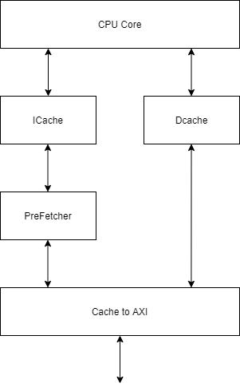
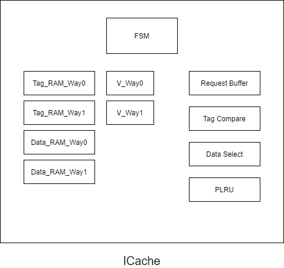
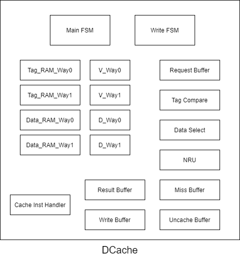

[TOC]

# NSCSCC2021决赛提交说明

## 中国科学院大学 1队 ##

### 2021年8月 ###

## 成员 ##

张翔雨、吴俊亮、贾志杰、王玮桐

## 设计简介

设计的CPU采用双发射静态七级流水，实现了61条指令、10种CP0寄存器、7种例外。采用AXI接口与总线交互。使用2路组相联8KB icache和2路组相联8KB dcache，采用写回、按写分配的设计，针对性能测试访存模式做了针对性优化。

## 总体设计思路


流水线与ICache和DCacahe交互，发出访存请求，接收访存响应和数据。ICache和DCache通过仲裁器对外发出访存请求，接收访存响应和数据。

## 流水线功能设计


<center>图1 流水线结构图

CPU 采用双发射静态七级流水结构，流水线分为 preIF、IF、ID、EXE、preMEM、MEM、WB 七级。区别于传统的五级流水线结构，我们的设计将取指和访存都划分为两级流水，将请求和响应分开，以实现理想情况下无阻塞流水线，同时可以获得更高主频。

### preIF

preIF 级是 PC 寄存器所在位置，主要功能为生成 next_PC，向 icache 发出取指请求。

### IF

IF 级接收 icache 响应，将收到的指令写入指令缓存队列。该缓存队列是一个 16 项的环形队列，只要未满就可以一直向后取指。同时 IF 级也负责预译码和指令发射。预译码判断队首两个指令是否有无法处理的相关，转移指令是否和它的延迟槽一起发射。确定可以发射后，将预译码信息和 PC 等信号传入 ID 级。

### ID

ID 级负责完全译码，根据 IF 级提供的预译码信息，生成所有需要的控制信号。转移指令的计算，以及转移目标的计算都在 ID 级处理。中断信号在这一级接入流水线，前递数据也在这一级汇总。

### EXE

EXE 级负责除转移指令外，所有的计算任务。两个指令分别有各自的 ALU，共享一个乘除法运算部件。

### preMEM

preMEM 级是进行例外处理的地方，连接 CP0、HILO 寄存器。例外的响应和流水线的清空在这里进行。同时，preMEM 也负责向 dcache 发出访存请求。

### MEM

MEM 级接收访存响应，对 load 返回的数据进行拼接等处理，生成最终结果。

### WB

WB 级负责写回寄存器，有两种工作模式：一种每拍可以同时写两条指令；另一种每拍只能写一条指令，用于功能验证。


## 流水级级间设计


<center>图2 级间控制信号

### 流水级控制信号

流水线前后级通过 to_next_valid 和 allowin 信号进行控制。每个流水级自身也有 valid 和 readygo 信号控制自身流水级。valid 表明流水级的数据是否有效，readygo 表明该流水线是否处理完成，可以流向下一流水级。to_next_valid = valid & readygo，表示可以进入下一个流水级且数据有效。allowin 表明下一个流水级是否允许数据进入。当一对 to_next_valid / allowin 信号同时有效，指令和数据从前一流水级流入后一流水级。

### 前递设计


<center>图3 前递通路设计

EXE、preMEM、MEM、WB 级均向 ID 级发送前递数据，在 ID 生成正真的 rs_value、rt_value。同时，IF也有接收前递数据，用于生成转移指令所需 rs_value、rt_value。

### 例外处理设计

例外处理在 preMEM 级进行，由该级生成清空信号，递给前面的所有流水级，之后的 MEM、WB 级不受影响。

### CP0寄存器处理

CP0寄存器的读写操作在 preMEM 级进行，一共实现了 
```
Cause
Status
EPC
Count
Compare
BadVAddr
EntryHi
EntryLo0
EntryLo1
Index
```
这10个CP0寄存器。

## 访存子系统设计

### 总体结构
访存子系统的总体结构如下图所示。CPU核分别向ICache和DCache发送访存请求，接收访存响应。ICache和DCache通过Cache2AXI模块向AXI总线发送访存请求，其中DCache的优先级较高。在ICache和Cache2AXI模块间实现了硬件预取器，其对ICache透明。



<center>图4 访存结构图

### ICache

#### 概述
ICache使用两路组相联的组织形式，Cache行大小32B，每路128行，每路大小4KB，共计8KB。其结构如下图所示。

其中两路的Tag，Data使用Xilinx IP Block RAM实现，两路的V使用寄存器实现。在第一拍，ICache接收请求，请求信息存入Request Buffer中，同时生成Tag_RAM和Data_RAM的地址；在第二拍，将Tag_RAM读出的Tag和Request Buffer中的Tag进行对比，判断是否命中以及命中哪一路，从Data_RAM读出的数据中选择出返回的数据。Cache替换策略使用线性伪LRU算法。



<center>图5 ICache设计

#### 针对双发射的优化

ICache会返回请求地址所处的Cache行的全部数据，即返回1-8条有效指令。返回的指令暂存于指令FIFO中。因取指速率远大于发射速率，一般不会因指令不足而造成阻塞。

#### FSM
| 状态 | 说明 |
| :--: | :--: |
| IDLE    | Cache处于空闲状态，可以接收新请求 |
| LOOKUP  | Cache正在判断请求是否命中，若命中则可以接收新请求 |
| REPLACE | Cache正在请求读取一行 |
| REFILL  | Cache正在接收数据并写回Cache行 |
| UREQ    | Cache正在发送uncache访存请求 |
| URESP   | Cache正在等待或接收uncache访存数据 |
| ILOOK   | Cache正在预处理Cache指令 |
| ICLEAR  | Cache正在按Cache指令要求对Tag、V进行操作 |

### DCache

#### 概述
DCache使用两路组相联的组织形式，Cache行大小32B，每路128行，每路大小4KB，共计8KB。其结构如下图所示。

其中两路的Tag，Data使用Xilinx IP Block RAM实现，两路的V，D使用寄存器实现。在第一拍，DCache接收请求，请求信息存入Request Buffer中，同时生成Tag_RAM和Data_RAM的地址；在第二拍，将Tag_RAM读出的Tag和Request Buffer中的Tag进行对比，判断是否命中以及命中哪一路，从Data_RAM读出的数据中选择出返回的数据。Cache替换策略使用NRU算法。

DCache采用写回写分配的策略，将需要写回的Cache行的数据暂存在Miss Buffer中。针对Uncache的写操作，将其暂存在Uncache Buffer中，随后返回data_ok表示已完成写操作，避免流水线长时间阻塞。后续若出现Uncache的读操作，则会阻塞直至Uncache Buffer清空，保证读写的顺序一致性。

针对Cache的写操作，在读出Tag和Data读出的当拍不进行Data_RAM的写操作，以避免引入从RAM输出端到RAM输入端的的路径。使用Write FSM和Write Buffer来暂存写操作的数据和控制信号，下一拍再进行Data_RAM的写操作。

为避免DCache读出数据前递到ID级的长路径，DCache读出的数据在寄存器中缓存一拍才能返回给CPU核，因为CPU核中在EXE级发送访存请求，在PreMEM级后的MEM级接收访存结果，且DCache在缓存这一拍可以照常进行其他操作（流水化），所以不会因缓存数据造成额外阻塞。



<center>图6 DCache设计

#### 针对双发射的优化

CPU核会同时发出两个Cache请求，在这种情况下，DCache总是同时接受两个请求，在内部进行处理。对两个相同操作（2读/2写）的且处于同一Cache行的请求，DCache可以并行执行；其他情况下DCache串行执行两个请求，效率和单发射时相同。

之所以只并行处理同一Cache行的请求，是因为大多数连续的访存指令都是访问连续的内存空间（例如将寄存器存入栈中，进行memcpy操作等），若增加对非同一Cache行的两个请求并行处理的支持，则需要考虑两个不同Cache行的缺失/一个Cache命中一个Cache缺失的情况，增加状态机和控制逻辑的复杂度。

#### FSM
| 状态 | 说明 |
| :--: | :--: |
| IDLE    | Cache处于空闲状态，可以接收新请求 |
| PRELOOK | Cache因某些原因没有及时生成第二个请求的地址信息，需要额外一拍准备 |
| LOOKUP  | Cache正在判断请求是否命中，若命中则可以接收新请求或处理第二个请求 |
| MISS    | Cache正在写回脏的Cache行 |
| REPLACE | Cache正在请求读取一行 |
| REFILL  | Cache正在接收数据并写回Cache行 |
| URREQ   | Cache正在发送uncache的读操作访存请求 |
| URRESP  | Cache正在等待或接收uncache的读操作访存数据 |
| UWREQ   | Cache正在发送uncache的写操作访存请求 |
| UWRESP  | Cache正在等待uncache的写操作完成 |
| ILOOK   | Cache正在预处理Cache指令 |
| IWB0    | Cache正在因Cache指令写回脏的第一路的Cache行 |
| IWB1    | Cache正在因Cache指令写回脏的第二路的Cache行 |
| ICLEAR  | Cache正在按Cache指令要求对Tag、V、D进行操作 |

### 预取器
我们猜测当一个Cache行缺失后，Cache很可能在不久后请求下一个Cache行。于是我们（几乎总是）预先取回下一个Cache行的数据，存在Buffer中。

在Buffer为空时，我们修改ICache发往Cache2AXI模块的信号，加倍取指数量。在AXI总线返回第一个Cache行的数据后，先将这些数据返回给ICache，减少ICache的阻塞；随后将AXI总线返回的第二个Cache行的数据存入Buffer中。当ICache的访存请求命中Buffer后，需要重新载入Buffer。此时向AXI总线请求下一个Cache行。考虑发出请求但仍在等待数据时，ICache发出的新的访存请求，若此请求和已发送的预取请求地址相同，则等待数据返回即可；若两地址不同，则预取失败，此时发送正确的访存请求，并丢弃预取请求的数据。

预取器的FSM可以总结以上情况。

| 状态 | 说明 |
| :--: | :--: |
| IDLE    | 预取器处于空闲状态 |
| HIT     | 请求命中Buffer，正在发送下一Cache行读请求 |
| BAD     | 预取失败，正在等待错误预取的数据并丢弃 |
| MISS    | 正在接收返回ICache的数据 |
| FILL    | 正在接收填充Buffer的数据 |
| UNCACHE | 正在处理Uncache请求 |

### Cache2AXI模块
该模块接收ICache（预取器）和DCache的访存请求，仲裁后发往AXI总线。该模块分为四个子模块，AR子模块发送读请求；R子模块接收读数据；AW子模块发送写请求和写数据；W子模块接收写响应。

## TLB设计

16项TLB，支持可变页大小配置。实现TLB缓存结构，支持多周期TLB查询：

1. 第一周期：若命中缓存，直接返回TLB查询结果。若不命中，跳转到第二周期更新缓存
2. 第二周期：缓存不命中，查询TLB并更新缓存。
3. 第三周期：返回查询结果，发出请求

TLBP指令复用访存级查询TLB逻辑，同样先查询缓存是否命中。当发生TLB写指令时，使TLB缓存内容无效。


## 成果演示
本CPU通过了AXI接口下的89个功能测试点、通过了记忆游戏测试、通过了10个性能测试点、通过了系统测试。

记录最终性能得分如下：
| clk | bitcount | bubble_sort | coremark | crc32 | dhrystone | quick_sort | select_sort | sha    | stream_copy | stringsearch | all    |
| :--:| :--:     | :--:        | :--:     | :--:  | :--:      | :--:       | :--:        | :--:   | :--:        | :--:         | :--:   |
| 90  | 4f8eb    | 296aa4      | 60acb6   | 4dfdd4| d6ef0    | 316489     | 3527ac      | 2a0182 | 3cdaa       | 1ef663       | 41.221 |


## 参考文献
1. 汪文祥,邢金璋.CPU设计实战[M].北京:机械工业出版社,2021.
2. [AXI总线概述](https://blog.csdn.net/bleauchat/article/details/96891619)
3. 李洪,毛志刚.PLRU替换算法在嵌入式系统cache中的实现[J].微处理机,2010,31(01):16-19